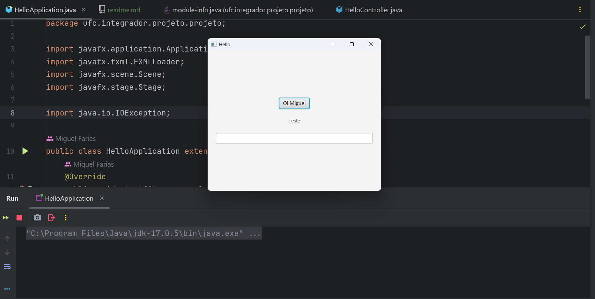

# TutorialJavaFX

<h1>Tecnologias utilizadas no projeto</h1>

[Maven](https://maven.apache.org/)

[SceneBuilder](https://maven.apache.org/)

[JavaFX](https://www.jetbrains.com/pt-br/idea/download/)

[Java 17 LTS](https://www.oracle.com/java/technologies/javase/jdk17-archive-downloads.html)

[IntelliJ Idea](https://www.jetbrains.com/pt-br/idea/download/)

